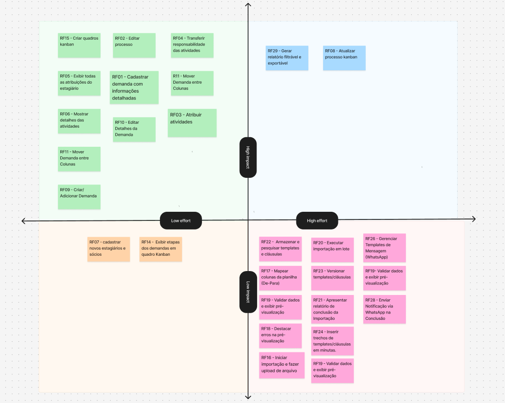

# Declaração de MVP
## Sistema de Gestão de Processos Jurídicos

---

## 1. Objetivos do MVP

### Objetivo Principal
Validar que escritórios de advocacia conseguem gerenciar processos jurídicos de forma colaborativa, com controle de prazos e responsabilidades, reduzindo em até 50% o tempo gasto na coordenação de atividades entre sócios e estagiários.

### Objetivos Específicos
- OE1 (Facilitar a visualização das demandas internas, assegurando uma divisão clara entre pendentes, em andamento, enviadas para revisão e concluídas.)
- OE2 (Reduzir a sobrecarga do sócio na atribuição de tarefas, permitindo que o fluxo de demandas seja distribuído de forma mais ágil e organizada.)
- OE3 (Minimizar riscos de falhas no cumprimento de prazos processuais, garantindo maior confiabilidade no acompanhamento.)

### Critérios de Sucesso
-  100% dos processos contêm todas as informações obrigatórias
-  Tempo de atribuição/transferência de atividade rápida
-  Taxa de adoção pelos estagiários no 1ª mês
-  Zero processos sem responsável atribuído
-  Redução de perguntas sobre responsabilidades

---

## 2. critérios de priorização (e sua aplicação): valor de negócio x avaliação técnica

- **MUST**: são absolutamente essenciais para que o produto funcione minimamente, resolva o problema central de visibilidade do fluxo de trabalho e atenda aos requisitos críticos de segurança e confiabilidade de um ambiente jurídico.

- **SHOULD**: são muito importantes, trazem alto valor agregado ao usuário e melhoram drasticamente a eficiência e a qualidade dos dados, mas existe um contorno (workaround) manual e temporário que o usuário pode executar no MVP.

- **COULD**: são desejáveis (nice-to-have), melhoram a experiência do usuário e a governança a longo prazo, mas não são cruciais para resolver o problema central do fluxo de trabalho. Sua ausência não impede o uso do MVP.

- **WONT**: estão fora do escopo do MVP por enquanto, porque seu custo de implementação é proibitivo em relação ao valor que entregam nesta primeira versão, ou porque a funcionalidade já está coberta por um requisito Must Have mais simples.

## 2.1 Níveis de Complexidade

| **Nível de Complexidade** | **Descrição (Custo de Trabalho)** |
|----------------------------|----------------------------------|
| **1 - Baixa** | O esforço de trabalho é mínimo. A implementação é direta e não requer decisões complexas ou coordenação externa. |
| **2 - Média** | O esforço de trabalho é padrão para uma funcionalidade (alguns dias, dentro de um micro-incremento ou parte de um Work Item). O caminho de implementação é bem compreendido. |
| **3 - Alta** | O esforço é significativo (vários dias ou mais de uma semana). Requer coordenação entre diferentes desenvolvedores ou papéis (como Analista e Arquiteto). Pode envolver integração com sistemas legados ou de terceiros (Requisitos de Interface). |
| **4 - Proibitiva** | O esforço é extremamente grande, podendo consumir a maior parte de uma iteração. Envolve alta incerteza técnica, exige mudanças arquiteturais significativas, ou requer aquisição de novo conhecimento/tecnologia. |

---

## 3. Escopo do MVP

### Funcionalidades Incluídas

| Objetivos Específicos | Prioridade | ID | Funcionalidade | Descrição |
|----------------------|-----------|----|----------------|-----------|
| OE1 | MUST | RF-01 | Cadastrar processo | Cadastro com cliente, número, petição modelo, atividade, andamento, prazo e responsável |
| OE1 | MUST | RF-02 | Editar processo | Atualizar informações do processo |
| OE2 | MUST | RF-03 | Atribuir atividades | Vincular tarefas a pessoas específicas |
| OE2 | MUST | RF-04 | Restrição de acesso | Controle por cargo: Sócio (visão total) e Estagiário (apenas suas atribuições) |
| OE2 | MUST | RF-05 | Transferir responsabilidade | Reatribuir atividades entre pessoas |
| OE1 | MUST | RF-07 | Visualizar detalhes | Exibir informações completas do processo |
| OE3 | MUST | RF-08 | Cadastrar usuários | Sócio cadastra novos estagiários e sócios |
| OE1 | MUST | RF-09 | Atualizar no Kanban | Alterar detalhes diretamente no quadro |
| OE1 | MUST | RF-12 | Kanban com etapas | Colunas configuráveis (Elaboração → Revisão → Pendente Cliente → Concluída) |
| OE1 | SHOULD | RF-06 | Dashboard do estagiário | Visualização de todas as atribuições do estagiário |
| OE1 | SHOULD | RF-10 | Criar processo no Kanban | Adicionar processo direto do quadro |

### Funcionalidades Excluídas
- Funcionalidades de automação de mensagem
- Importador de planilhas
- Dashboard de indicadores
- Repositório de cláusulas

---

## 4. Framework de Desenvolvimento

### 4.1 Kanban para o Desenvolvimento do MVP

**Políticas do Board de Desenvolvimento:**

- **BACKLOG**: Requisitos (RF-01 a RF-12) refinados e prontos para implementação
- **TO DO**: Work items priorizados para a sprint atual
- **IN PROGRESS**: Desenvolvimento ativo (máximo 3 itens para equipe de 2 devs)
- **REVIEW**: Code review e testes de aceitação (máximo 2 itens)
- **DONE**: Funcionalidade completa, testada e validada

**WIP Limits:**
- In Progress: 3 (1,5x o número de desenvolvedores)
- Review: 2 (evita gargalo na validação)

**Pull System:**
- Desenvolvedores puxam novos work items apenas quando concluem o anterior
- Prioridade: MUST > SHOULD > Could

### 4.2 Exemplo de Fluxo: Desenvolvimento do RF-01

1. **BACKLOG**: RF-01 é detalhado em 3 work items
   - WI-001: Backend - API de cadastro
   - WI-002: Frontend - Formulário
   - WI-003: Testes integrados

2. **TO DO**: WI-001 é priorizado para início (MUST)

3. **IN PROGRESS**: 
   - Dev 1 puxa WI-001
   - Aplica TDD: escreve teste, depois implementa
   - Duração: 2 dias

4. **REVIEW**:
   - Code review por Dev 2
   - Validação dos critérios de aceitação
   - Testes automatizados executados

5. **DONE**:
   - API funcionando
   - Testes passando
   - Documentação atualizada
   - Dev 1 puxa próximo item (WI-002)

### 4.3 Métricas de Acompanhamento

**Métricas Kanban (do nosso desenvolvimento):**

- **Lead Time**: Tempo de Backlog até Done
- **Cycle Time**: Tempo de To Do até Done
- **Throughput**: Work items concluídos por semana
- **Bloqueios**: Quantidade e tempo de itens bloqueados

### 4.4 Definição de Pronto (Definition of Done)

-  Código implementado conforme requisito
-  Testes unitários escritos e passando (cobertura ≥ 80%)
-  Code review aprovado por outro desenvolvedor
-  Funcionalidade testada manualmente
-  Validada com Product Owner (quando aplicável)
-  Documentação técnica atualizada
-  Sem bugs críticos ou bloqueantes
-  Integrado ao branch principal