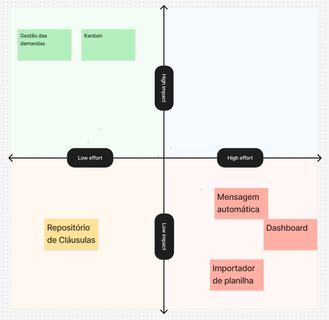

# Mínimo Produto Viável (MVP)

Esta página detalha o Product Backlog, os critérios de priorização e a definição do Mínimo Produto Viável (MVP) do nosso projeto, com base na análise de Esforço x Impacto.

## 1. Product Backlog

O backlog do produto é composto pelas seguintes funcionalidades e suas respectivas atividades:

### Gestão das demandas
- Cadastrar demanda com informações pertinentes
- Editar processo Workflow
- Atribuir atividades
- Restrições de acesso
- Transferir responsabilidade das atividades
- Gerir tipos de avaliações de exigência

### Kanban
- Atualizar processo kanban
- Área de criação de processo no Kanban
- Solicitar revisão de atividade
- Visualizar processo kanban

### Dashboard
- Exibir painel de indicadores (Dashboard)
- Indicador - Demandas por Status
- Indicador - Desempenho de Prazos (% On-time)
- Indicador - Tempo Médio de Resolução (TMR)
- Indicador - Prazos Críticos
- Indicador - Tempo até Primeira Ação (TTA)
- Indicador - Taxa de Retrabalho
- Gerar relatório filtrável e exportável

### Importador de planilha
- Iniciar importação e fazer upload da planilha
- Mapear colunas da planilha (De-Para)
- Destacar erros na pré-visualização
- Validar dados e permitir visualização
- Executar importação em lote
- Apresentar relatório de conclusão

### Mensagem automática
- Gerenciar Dados de Gatilho para Notificação
- Gerenciar Templates de Mensagem (Workflow)
- Configurar Gatilho de Notificação Automática
- Enviar Notificação via WhatsApp na Conclusão
- Registrar Envio de Notificação no Log

### Repositório de Cláusulas
- Armazenar e pesquisar templates e cláusulas
- Inserir trechos de templates de minutas
- Versionar templates/cláusulas

---

## 2. Priorização do Backlog

Para definir a prioridade das funcionalidades, utilizamos uma análise de Esforço x Impacto, com os seguintes critérios:

### Critérios de Priorização

* **Complexidade (Esforço):** Avaliado de acordo com a quantidade de requisitos (funcionais e não funcionais) associados a cada atividade e a experiência da equipe em implementá-los.
* **Valor de negócio (Impacto):** Avaliado com base na comunicação com o cliente sobre o que era mais importante, classificado da seguinte forma:
    * **0:** Necessidade do sistema
    * **1:** Funcionalidades principais
    * **2:** Funcionalidades desejáveis/inovadoras
    * **3:** Funcionalidades cortadas

### Matriz Esforço x Impacto

O resultado da análise posicionou as funcionalidades nos seguintes quadrantes:

---

## 3. Mínimo Produto Viável (MVP)

Com base na matriz de priorização, o MVP será composto pelas funcionalidades de **alto impacto** e **baixo esforço**, garantindo uma entrega de valor rápida e eficiente.

As funcionalidades selecionadas para o MVP são:

### Tema 1: Gestão das Demandas
- Cadastrar demanda com informações pertinentes
- Editar processo Workflow
- Atribuir atividades
- Restrições de acesso
- Transferir responsabilidade das atividades
- Gerir tipos de avaliações de exigência

### Tema 2: Kanban
- Atualizar processo kanban
- Área de criação de processo no Kanban
- Solicitar revisão de atividade
- Visualizar processo kanban