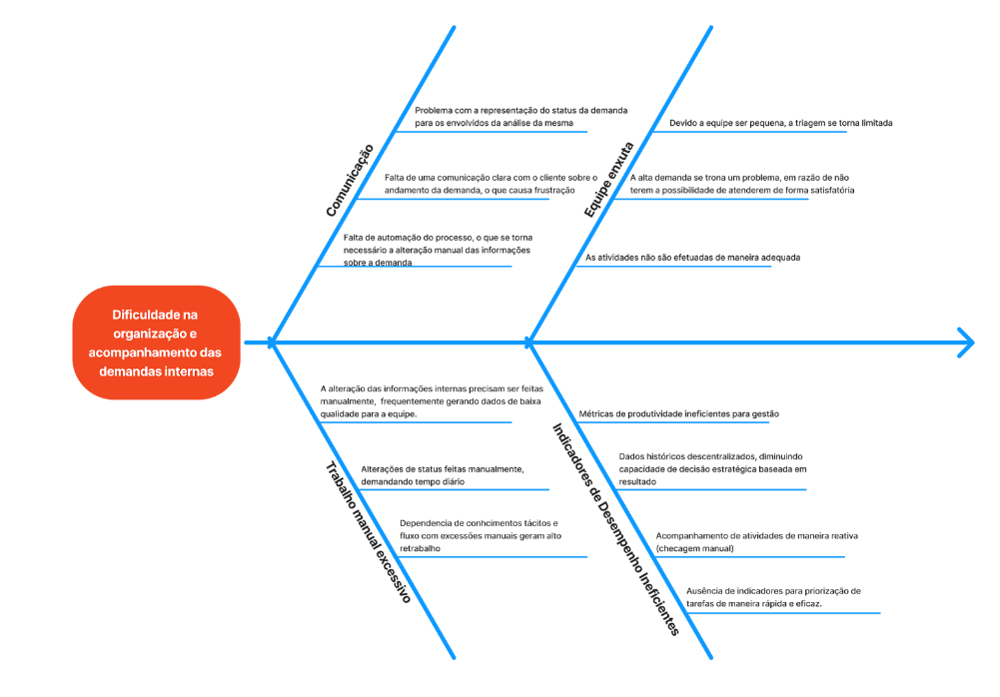

## Histórico de Revisão

| Data | Versão | Descrição | Autor |
| - | - | - | - |
| 01/09 | 1.0 | Criação do Documento | 232014413 - Davi Nunes;   231034716 - Gustavo Oki;   32014093 - Lucas Machado   232005343 - Marcos Filho; |
| 05/09 | 1.1 | Correção do Documento |  232014638 - Caio Soares;   232014413 - Davi Nunes;   231034716 - Gustavo Oki; |
| 15/09 | 1.2 | Primeira Entrega Final do documento de Visão do Produto e Projeto | 232001371 - Caio Rocha;   232014638 - Caio Soares;   232014413 - Davi Nunes;   231034716 - Gustavo Oki;   232014093 - Lucas Machado;   232005343 - Marcos Filho; |

## 1 CENÁRIO ATUAL DO CLIENTE E DO NEGÓCIO

### 1.1 Introdução ao Negócio e Contexto

O escritório Cortes, Santos Advogados (fundado em 27 de junho de 2018) atua como sociedade individual de advocacia, oferecendo soluções jurídicas personalizadas nas áreas consultiva, administrativa e contenciosa. Possui mais de 400 processos ativos distribuídos por praticamente todos os estados do Brasil, com atuação em licitações e contratos, tendo trabalhos especializados em diversas áreas do Direito: Civil, Administrativo, Previdenciário, Tributário, do Consumidor, Trabalhista e Empresarial. Apresenta um perfil conservador e orientado à minimização de riscos, priorizando soluções que evitem prejuízos ao cliente, enquanto sua gestão administrativa busca eficiência operacional.

O funcionamento do escritório age de uma forma enxuta e orientada por demandas: o sócio organiza e distribui as tarefas do dia a dia (feitas por planilhas Excel), executando prazos, preparando peças e acompanhando andamentos processuais. Têm-se atenção especial à confidencialidade, agilidade e ao atendimento pós-contratual, preservando um relacionamento pessoal e direto com cada cliente.

Mesmo que o escritório tenha implementado sistemas de gestão jurídica, como o Astraea, que se mostraram úteis para o controle rigoroso de prazos processuais e a centralização de documentos, sua rigidez provou-se um impeditivo crucial para a nossa principal necessidade e objetivo: a gestão dinâmica do fluxo de trabalho interno. Nesse sentido, o obstáculo central reside na falta de visibilidade e previsibilidade sobre o andamento das tarefas. Dessa forma, torna-se inviável rastrear de forma clara em qual etapa uma demanda se encontra, seja na fase de elaboração com o advogado júnior, pendente de revisão pelo sócio, ou aguardando documentação do cliente. Essa ausência de um fluxo estruturado gera atrasos, principalmente na transição de responsabilidade entre os profissionais, de forma a tornar o acompanhamento dos casos estratégicos uma atividade reativa e dependente de microgerenciamento, em vez de proativa e dinâmica.

Essa ineficiência se ramifica em dois outros desafios operacionais relevantes, sendo elas: a comunicação com cliente de forma manual, que consome um tempo significativo da equipe na elaboração de relatórios de andamento que poderiam ser padronizados e automatizados, e a carência de uma base de conhecimento unificada e de fácil acesso; a pesquisa por cláusulas contratuais específicas ou modelos de propostas de honorários depende da consulta a arquivos antigos e dispersos, resultando em inconsistência e retrabalho. Nesse contexto, a prioridade torna-se reestruturar o fluxo de trabalho do cliente a fim de trazer clareza, coerência e previsibilidade que culminam na eficiência do processo de qualidade e pontualidade.

O mercado de advocacia brasileiro hoje é bastante vasto e fragmentado, com um número muito elevado de profissionais e escritórios atuando em nichos e em grande concorrência, o que pressiona preços e exige diferenciação.

Há, ao mesmo tempo, uma volatilidade na demanda por serviços e uma forte aceleração na adoção de tecnologia e automação (como uso de ferramentas de IA) como forma de ganhar produtividade, reduzir tarefas repetitivas e oferecer respostas mais rápidas aos clientes. Além disso, o surgimento de regras sobre proteção de dados e compliance eleva a demanda por boas práticas de governança digital e segurança da informação nos escritórios.

Para um escritório conservador e enxuto como o Cortes, Santos Advogados, este cenário reforça a necessidade de um sistema de gestão de demandas que garanta total controle sobre o fluxo de trabalho. A solução proposta irá mapear e organizar cada caso individualmente, permitindo a automação pontual de tarefas repetitivas, como o preenchimento de formulários e gestão de documentos digitais, por exemplo, além do envio de alertas automáticos para prazos críticos. Dito isso, tais funcionalidades, implementadas em uma plataforma com segurança de dados e controle de acesso granular, visam otimizar a eficiência sem comprometer a confidencialidade, a segurança ou a relação próxima com o cliente.

### 1.2 Identificação da Oportunidade ou Problema

O escritório enfrenta um gargalo operacional na gestão e no acompanhamento das demandas processuais, exigindo que o sócio faça checagens diárias manuais a fim de repassar as tarefas por planilha ao estagiário. Além dessa rotina consumir um tempo crucial, que poderia ser usado para outras demandas, gera risco de retrabalho e reduz a visibilidade sobre a real responsabilidade de cada ação. Tal cenário gera frustração nos clientes, que acreditam não haver trabalho em andamento, abrindo espaço para uma solução mais simples e focada em: ordenação de demandas, indicadores de pendência/urgência e notificações automáticas aos clientes.

* Alto volume de demandas: lidam com cerca de 300--400 ativas;
* Controle manual: Excel/planilhas e fluxos informais de atribuição;
* Equipe enxuta: capacidade limitada de triagem e execução;
* Problemas com comunicação: falta de automação/alertas que informam clientes e responsáveis sobre andamentos, provocando frustração nos clientes que acreditam não haver trabalho em andamento.

Além disso, sistemas já contratados como o Astraea não se mostraram totalmente adequados ao modelo mais pessoal de atendimento do escritório, abrindo espaço para uma solução sob medida, que atenda às necessidades específicas do cliente.

### 1.3 Desafios do Projeto

Os principais desafios do projeto decorrem tanto de aspectos técnicos quanto organizacionais, pois é preciso substituir o controle manual por planilhas e as checagens diárias por uma gestão automatizada, sem perder o modelo de atendimento pessoal e confidencial que caracteriza o escritório.

Tecnicamente, o maior desafio é a falta de acesso a sistemas jurídicos legados ou anteriormente testados pelo cliente. Não ter acesso a essas plataformas, como o Astraea, dificulta a realização de testes de interoperabilidade. Isso nos obriga a focar na criação de uma solução com uma estrutura de dados robusta e flexível, que permita a migração segura das informações do Excel, além de um design de sistema que se adapte, de forma simplificada, à diferentes possíveis formatos de dados no futuro.

Do ponto de vista operacional, o projeto precisa conciliar a automação com a preservação da experiência personalizada do cliente. Dessa maneira, torna-se essencial prever treinamento e gerenciar a mudança de hábitos da equipe enxuta para garantir adesão e evitar retrabalho. Além disso, é crucial operar com as restrições orçamentárias e de tempo do sócio responsável. Para mais, existem ainda desafios legais e de segurança, como garantir a confidencialidade e os controles de acesso por processo/estado, além da conformidade com as boas práticas de gestão de dados. A complexidade aumenta por lidar com processos distribuídos em vários estados, cerca de 300 a 400 processos ativos, o que exige regras e exceções específicas.

Por fim, será crucial medir o impacto do projeto por meio de indicadores claros de redução de tempo manual, melhoria na satisfação do cliente e diminuição de erros. A implantação faseada da solução será determinante para o sucesso, pois ajudará a minimizar os riscos operacionais.

### 1.4 Segmentação de Clientes

Nosso produto de software será direcionado principalmente a dois perfis de usuários, com faixa etária entre 20 e 55 anos: sócios/advogados experientes e estagiários/advogados em início de carreira. A seguir, detalhamos cada grupo:

* Sócios e Advogados Experientes: este grupo é composto, em sua maioria, por profissionais entre 30 e 55 anos, com média de 12 a 25 anos de experiência na advocacia. Normalmente ocupam cargos de liderança, como sócios ou gestores de escritórios. São responsáveis pela administração do negócio, prospecção de clientes e supervisão das operações jurídicas e administrativas. A principal dificuldade enfrentada por esse perfil é o excesso de tarefas manuais de controle e delegação, que consomem tempo e dificultam a visão geral do andamento das demandas. Seu objetivo é otimizar demandas, reduzir custos administrativos e direcionar esforços para atividades de maior valor estratégico.
* Estagiários e Profissionais em Início de Carreira: composto por jovens entre 20 e 28 anos, geralmente com até 5 anos de experiência na área jurídica. Esse grupo atua em atividades operacionais e de apoio, como elaboração de minutas, acompanhamento processual e atualização de informações. São profissionais que necessitam de uma ferramenta intuitiva para organizar demandas, atualizar status em tempo real e se comunicar de forma ágil com seus gestores. O objetivo principal é ganhar eficiência no dia a dia, aprender com mais clareza os fluxos internos e acelerar o desenvolvimento na carreira.